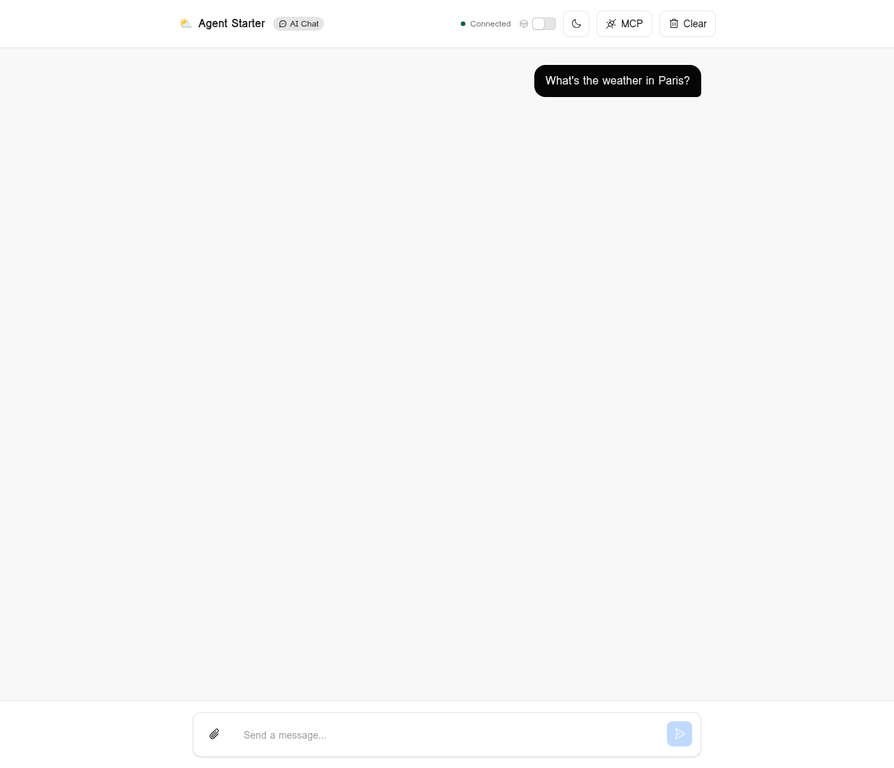
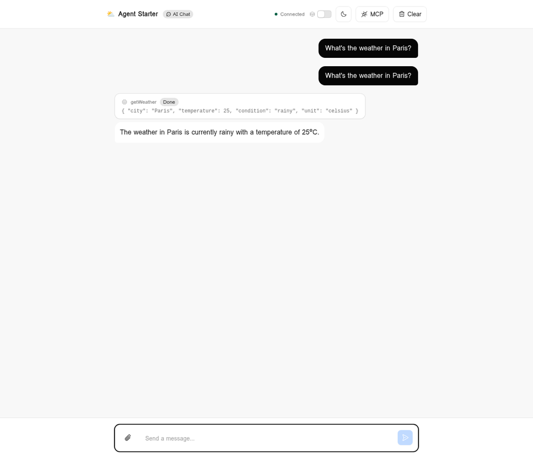
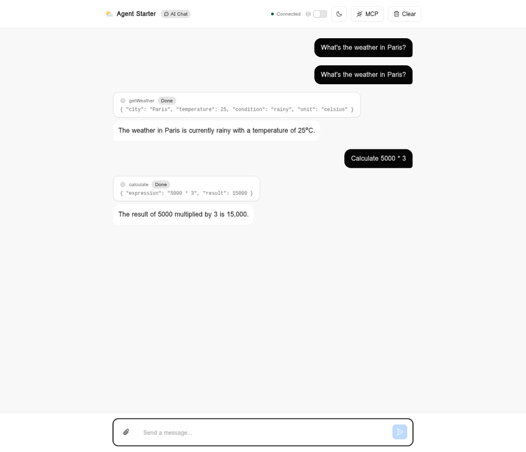
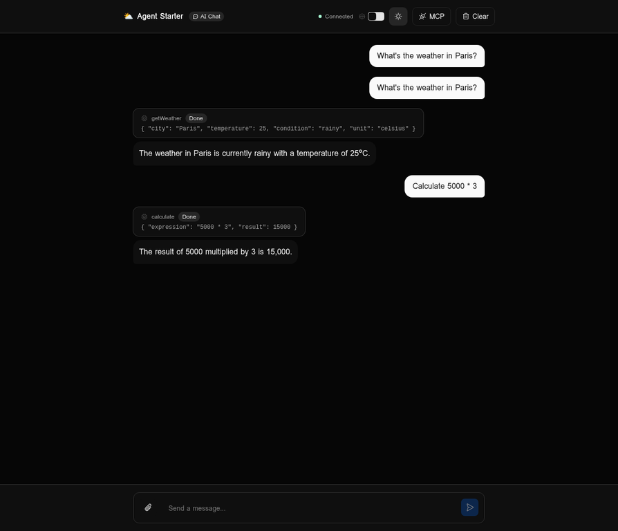

# Cloudflare Agent Starter

> Built during **Cloudflare Agents Week 2026** — a week of announcements across the full agent stack: compute, connectivity, security, identity, and economics.



<a href="https://deploy.workers.cloudflare.com/?url=https://github.com/daryllundy/cloudflare-agent-starter"></a>

A refactored starter for building AI chat agents on Cloudflare, powered by the [Agents SDK](https://developers.cloudflare.com/agents/). This project began from the official [`cloudflare/agents-starter`](https://github.com/cloudflare/agents-starter) template and now includes an OpenAI-backed chat model, modular React UI, MCP server management, image attachments, scheduling tools, and unit-tested shared logic.

## What is Cloudflare Agents Week?

Cloudflare held **Agents Week** (April 12–18, 2026), announcing a full suite of primitives for building AI agents at scale. The centerpiece was **[Project Think](https://blog.cloudflare.com/project-think/)** — the next generation of the Agents SDK — which introduced:

| Feature                        | Description                                                       |
| ------------------------------ | ----------------------------------------------------------------- |
| **Durable Execution (Fibers)** | Crash-recovery and checkpointing for long-running LLM calls       |
| **Sub-agents**                 | Isolated child agents with their own SQLite and typed RPC         |
| **Persistent Sessions**        | Tree-structured message history with forking and full-text search |
| **Sandboxed Code Execution**   | Dynamic Workers, runtime npm resolution, browser automation       |
| **Self-authored Extensions**   | Agents that write their own tools at runtime                      |

The key insight: traditional apps serve many users from one instance. Agents are **one-to-one** — each agent is a unique instance for one user or task. Cloudflare's Durable Objects make this economically viable by hibernating agents when idle (zero compute cost) and waking them on demand.

## Screenshots

### Empty Chat (Light Mode)


### Weather Tool Response (Server-side auto-execute)



### Calculation with Human-in-the-Loop Approval


### Calculation Result After Approval



### Dark Mode



## Quick Start

```bash
git clone https://github.com/daryllundy/cloudflare-agent-starter.git
cd cloudflare-agent-starter
npm install
npm run check
```

For local development with the OpenRouter-backed setup:

```bash
# Create .dev.vars with your API key
echo "OPENROUTER_API_KEY=your-key-here" > .dev.vars
echo "OPENROUTER_BASE_URL=https://openrouter.ai/api/v1" >> .dev.vars
echo "OPENROUTER_MODEL=openai/gpt-4o-mini" >> .dev.vars

# Start the app
npm run dev
```

If `OPENROUTER_API_KEY` is not set, the agent automatically falls back to
Cloudflare Workers AI (`@cf/moonshotai/kimi-k2.6` by default; override via
`WORKERS_AI_MODEL`).

Run `npm run check` before committing to execute formatting, linting, TypeScript, and unit tests.

Open [http://localhost:8787](http://localhost:8787) to use the app locally.

Try these prompts:

- **"What's the weather in Paris?"** — server-side tool (runs automatically)
- **"What timezone am I in?"** — client-side tool (browser provides the answer)
- **"Calculate 5000 \* 3"** — approval tool (asks you before running)
- **"Remind me in 5 minutes to take a break"** — scheduling
- **Drop an image and ask "What's in this image?"** — vision (image understanding)

## Project Structure

```
src/
  app.tsx                 # Top-level app composition
  client.tsx              # React entry point
  chat-config.ts          # Shared starter prompts and UI constants
  chat-logic.ts           # Pure chat helpers with unit tests
  components/             # Header, input, message, theme, and MCP UI
  hooks/                  # Chat agent and attachment state hooks
  server.ts               # Durable Object entrypoint
  server/
    messages.ts           # Incoming message normalization
    model.ts              # Model provider wiring
    prompt.ts             # System prompt construction
    tools.ts              # Server-side tool definitions
  styles.css              # Tailwind + Kumo styles
```

## Architecture

This agent runs on **Cloudflare Workers** with **Durable Objects** providing per-agent state. Each chat session is a unique Durable Object instance with its own SQLite database. The agent:

1. Receives messages via WebSocket
2. Normalizes and prunes chat history before model execution
3. Calls the LLM with the conversation history
4. Executes tools (weather, calculator, scheduler, MCP tools) as needed
5. Streams structured UI messages back to the client
6. Persists all messages in SQLite
7. Hibernates when idle — zero compute cost

## What's Included

- **AI Chat** — Streaming responses via `AIChatAgent`
- **Image input** — Drag-and-drop, paste, or click to attach images for vision models
- **Three tool patterns** — server-side auto-execute, client-side (browser), and human-in-the-loop approval
- **Scheduling** — one-time, delayed, and recurring (cron) tasks
- **Reasoning display** — shows model thinking as it streams, collapses when done
- **Debug mode** — toggle in the header to inspect raw message JSON
- **Kumo UI** — Cloudflare's design system with dark/light mode
- **Modular frontend** — chat state, attachments, MCP UI, and message rendering are split into focused hooks and components
- **Real-time** — WebSocket connection with automatic reconnection and message persistence
- **MCP support** — Connect external tools from any MCP server
- **Unit tests** — Vitest coverage for extracted prompt, message normalization, and shared helper logic

## Development Workflow

```bash
npm run dev
```

```bash
npm test
```

```bash
npm run check
```

`npm test` runs the Vitest suite. `npm run check` runs formatting, linting, TypeScript, and unit tests.

## Using a Different AI Model

### OpenRouter (current default)

`src/server/model.ts` uses the OpenAI SDK pointed at OpenRouter, so any
OpenAI-compatible model OpenRouter exposes works out of the box. Set
`OPENROUTER_MODEL` to any slug from the
[OpenRouter model list](https://openrouter.ai/models) — e.g.
`openai/gpt-4o-mini`, `anthropic/claude-3.5-sonnet`,
`meta-llama/llama-3.1-70b-instruct`.

`wrangler.jsonc` ships with:

```json
"vars": {
  "OPENROUTER_BASE_URL": "https://openrouter.ai/api/v1",
  "OPENROUTER_MODEL": "openai/gpt-4o-mini"
}
```

Add to `.dev.vars` (local only, never commit):

```
OPENROUTER_API_KEY=sk-or-...
OPENROUTER_BASE_URL=https://openrouter.ai/api/v1
OPENROUTER_MODEL=openai/gpt-4o-mini
```

For production, store `OPENROUTER_API_KEY` as a Cloudflare secret:

```bash
wrangler secret put OPENROUTER_API_KEY
```

`OPENROUTER_BASE_URL` can point at Cloudflare AI Gateway's OpenAI-compatible
endpoint if you want gateway logging/caching.

### Workers AI fallback

If `OPENROUTER_API_KEY` is unset, the agent uses the bound Workers AI model
defined by `WORKERS_AI_MODEL` (default `@cf/moonshotai/kimi-k2.6`). No code
changes required — set or unset the secret to switch providers.

## Deploy to Cloudflare

```bash
npm run deploy
```

Your agent is live on Cloudflare's global network. Messages persist in SQLite, streams resume on disconnect, and the agent hibernates when idle.

## Learn More

- [Project Think blog post](https://blog.cloudflare.com/project-think/)
- [Agents Week in Review](https://blog.cloudflare.com/agents-week-in-review/)
- [Agents SDK documentation](https://developers.cloudflare.com/agents/)
- [Build a chat agent tutorial](https://developers.cloudflare.com/agents/getting-started/build-a-chat-agent/)
- [Workers AI models](https://developers.cloudflare.com/workers-ai/models/)

## License

MIT
